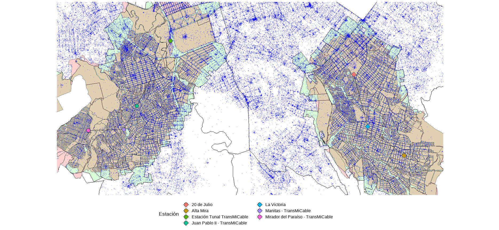

# Paquetes en R.

* R tiene cerca de **19.000** paquetes disponibles. Sin embargo, no todos los paquetes son necesarios para su uso.

* Los [10 paquetes](https://www.datacamp.com/tutorial/top-ten-most-important-packages-in-r-for-data-science) más populares en R:

  1. [ggplot2](https://ggplot2.tidyverse.org/): Visualización de datos. Basado en *Gramática de gráficos*
  

  {width=90%}
  {width=90%}
  
  2. [data.table](https://cran.r-project.org/web/packages/data.table/vignettes/datatable-intro.html): Paquete para manipulación de bases de datos más rápido.
  3. [dplyr](https://www.rdocumentation.org/packages/dplyr/versions/0.7.8): Paquete de manipulación de datos. 
  4. [tidyr](https://posit.co/blog/introducing-tidyr/): Limpiar y procesar datos
  5. [Shiny](https://shiny.rstudio.com/tutorial/written-tutorial/lesson1/): Creación de aplicación web sin necesida de JavaScript.
  6. [plotly](https://plotly.com/r/getting-started/): Creación de gráficos interactivos.
  7. [kntir](https://yihui.org/knitr/): Utilizado para la creación de reportes. Varios tipos de estructuras: LaTex, HTML, Markdown, LyX.
  8. [mlr3](https://mlr.mlr-org.com/): Funciones de Machine Learning.
  9. [XGBoost](https://xgboost.readthedocs.io/en/stable/R-package/xgboostPresentation.html): Implementación de Gradient Boosting.
  10. [Caret](https://topepo.github.io/caret/): Classification And Regression Training. Funciones para implementar modelos y postestimación.

* En esta clase utilizaremos:

  1. [pacman](https://www.rdocumentation.org/packages/pacman/versions/0.5.1): Facilita la vida para hacer cosas comunes. Cargar paquetes.
  2. [rio](https://cran.r-project.org/web/packages/rio/vignettes/rio.html): Funciones muy potentes para importar, exportar y transformar bases.
  3. [skimr](https://cran.r-project.org/web/packages/skimr/vignettes/skimr.html): Estadísticas descriptivas de objetos.
  4. [tidyverse](https://www.tidyverse.org/#:~:text=The%20tidyverse%20is%20an%20opinionated,%2C%20grammar%2C%20and%20data%20structures.&text=See%20how%20the%20tidyverse%20makes,%E2%80%9CR%20for%20Data%20Science%E2%80%9D.): Funciones para manejo de datos
  5. [readr](https://readr.tidyverse.org/): Funciones muy potentes para importar y exportar bases de datos.
  6. [sf](https://r-spatial.github.io/sf/): Funciones para manejos de datos espaciales.


# El operador pipe

* R puede ser muy potente para hacer cosas funcionales.

* Podemos ser eficientes en la manera de escribir código.

* Este operador permite:
  
    - Reescribir lineas de código en una sola
    - Ser claros a la hora de escribir código.

* Veamos algunos ejemplos:

```{r grafis, echo = F, eval = T, include = F}
# Cargando los paquetes ---------------------------

library(ggplot2)
library(dplyr)
library(knitr)

```

```{r graficos, echo = TRUE, eval = F}
# Cargando los paquetes ---------------------------

library(ggplot2)
library(dplyr)
library(knitr)

# Creando la gráfica  -----------------------------

mtcars %>% 
  ggplot() +
  geom_smooth(aes(x = mpg,y = hp),method = lm, se = T) +
  geom_point(aes(x = mpg,y = hp, size = cyl, fill = qsec), shape = 21, color = "black") +
  annotate(geom = "text",x = 28,y = 250,label = "italic(R) ^ 2 == 0.6024", parse = T) +
  annotate(geom = "curve", x = 24, y = 111, xend = 26, yend = 245, curvature = -0.3, arrow = arrow(length = unit(2, "mm"))) +
  labs(x = "Miles per Gallon", y = "Horse Power", size = "Cilinders", fill = "Quater a Mile (sec)") +
  scale_x_continuous(breaks = seq(0,35,2)) +
  scale_y_continuous(breaks = seq(0,350,50)) +
  scale_fill_viridis_b() +
  theme_classic() +
  theme(legend.position = "bottom",
        axis.text = element_text(color = "black"))
```

```{r graficos2, echo=FALSE}
mtcars %>% 
  ggplot() +
  geom_smooth(aes(x = mpg,y = hp),method = lm, se = T) +
  geom_point(aes(x = mpg,y = hp, size = cyl, fill = qsec), shape = 21, color = "black") +
  annotate(geom = "text",x = 28,y = 250,label = "italic(R) ^ 2 == 0.6024", parse = T) +
  annotate(geom = "curve", x = 24, y = 111, xend = 26, yend = 245, curvature = -0.3, arrow = arrow(length = unit(2, "mm"))) +
  labs(x = "Miles per Gallon", y = "Horse Power", size = "Cilinders", fill = "Quater a Mile (sec)") +
  scale_x_continuous(breaks = seq(0,35,2)) +
  scale_y_continuous(breaks = seq(0,350,50)) +
  scale_fill_viridis_b() +
  theme_classic() +
  theme(legend.position = "bottom",
        axis.text = element_text(color = "black"))
```

```{r pipe1, echo = TRUE, eval = F}
mtcars %>% 
  group_by(gear) %>% 
  summarise(carros = n(),
          mpg = mean(mpg),
          max_mpg = max(mpg),
          hp = mean(hp),
          max_hp = max(hp),
          wt = mean(wt),
          max_wt = max(wt),
          qsec = mean(qsec),
          max_qsec = max(qsec),
          vs = mean(vs),
          max_vs = max(vs)) %>% 
  knitr::kable("pipe")

```

```{r pipe2, echo=FALSE}
mtcars %>% 
  group_by(gear) %>% 
  summarise(carros = n(),
          mpg = mean(mpg),
          max_mpg = max(mpg),
          hp = mean(hp),
          max_hp = max(hp),
          wt = mean(wt),
          max_wt = max(wt),
          qsec = mean(qsec),
          max_qsec = max(qsec),
          vs = mean(vs),
          max_vs = max(vs)) %>% 
  knitr::kable("pipe")

```
